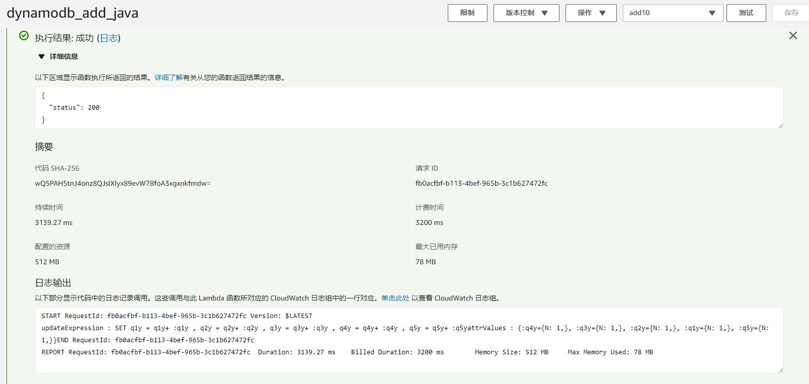
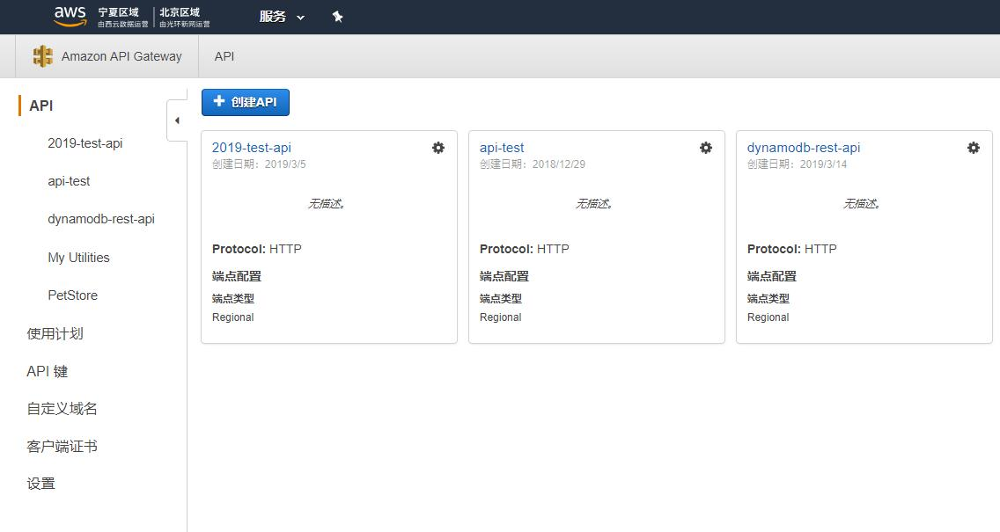
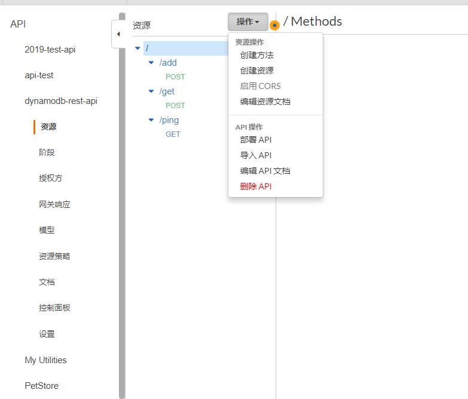
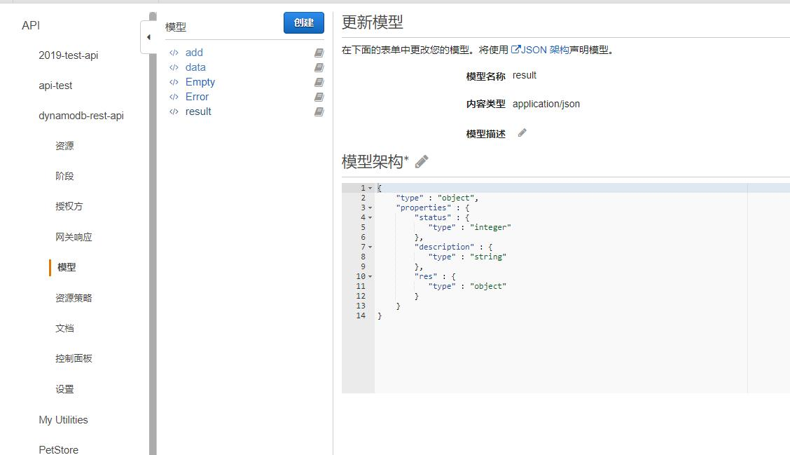
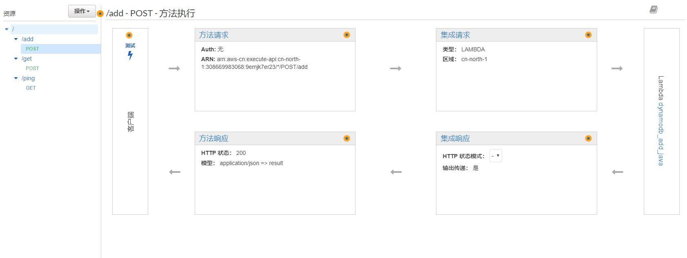
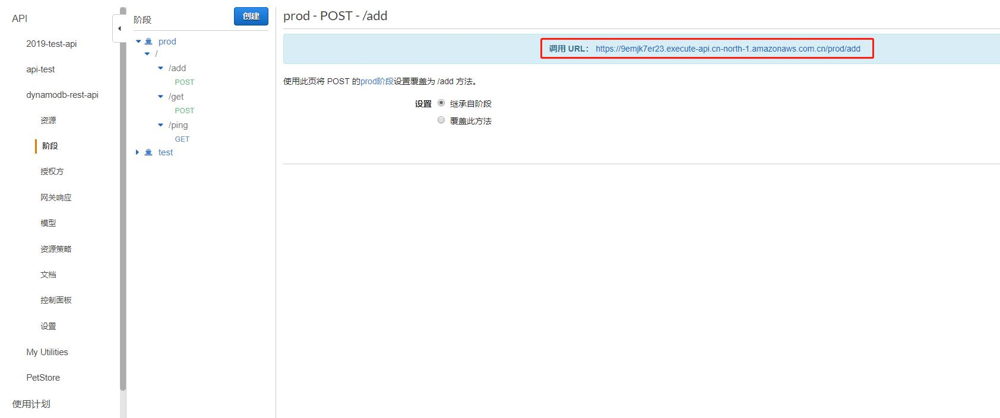

# lambda
lambda是aws的无服务部署方式，支持多种语言，java8、python、nodejs等。
lambda可以采用多种触发方式，包括aws的sqs、sns、邮件、以及各种流式处理器，
也支持使用aws gateway直接用http方式触发。

本文介绍如何使用lambda + gateway 构建一个无服务的web程序

# 程序打包

maven配置加入
```xml
<build>
    <plugins>
        <plugin>
            <groupId>org.apache.maven.plugins</groupId>
            <artifactId>maven-shade-plugin</artifactId>
            <version>2.3</version>
            <configuration>
                <createDependencyReducedPom>false</createDependencyReducedPom>
            </configuration>
            <executions>
                <execution>
                    <phase>package</phase>
                    <goals>
                        <goal>shade</goal>
                    </goals>
                </execution>
            </executions>
        </plugin>
    </plugins>
</build>
```

打包命令：`mvn package -Dmaven.test.skip`

# lambda上传

https://console.amazonaws.cn/lambda

登陆aws管理系统，进入lambda控制台。
- 创建函数
- 函数代码
  - 上传jar包
  - 设置处理程序 `org.fran.cloud.aws.lambda.GeneralDynamoDBOperate::add`

# lambda测试

配置测试事件
```json
{
  "id": "2019boao",
  "item": {
    "q1y": 1,
    "q1n": 0,
    "q2y": 1,
    "q2n": 0,
    "q3y": 1,
    "q3n": 0,
    "q4y": 1,
    "q4n": 0,
    "q5y": 1,
    "q5n": 0
  }
}
```

执行测试，在上方会打印测试日志




# 配置网关

https://console.amazonaws.cn/apigateway/home?region=cn-north-1#/apis

进入网关控制台



# 创建api

创建网关，选择rest类型

# 管理资源



资源为gatewayapi的入口。
需要创建资源，在资源下创建方法

## 操作
- 创建方法（Method GET POST等）
- 创建资源（访问路径）
- 部署api（发布到阶段中，可以对外提供访问地址）

## 模型管理


自定义请求、返回的模型，后续需要绑定到方法中


## 方法管理


点击`方法请求` `方法响应`设置返回模型、请求模型。

# 发布

在操作中，点击部署api功能。
发布到阶段中。红色部分为外网（需要联系管理员开启）可以访问的地址。




